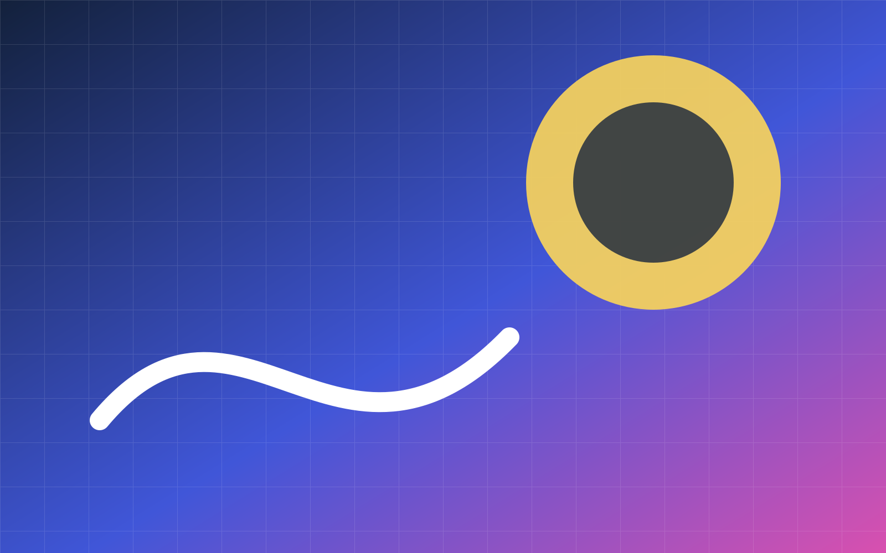

<!-- slide: cover -->

# Base Light

温暖、清晰、克制的基础主题。

---

<!-- slide: section -->

# 章节页

建立叙事节奏。

---

# 标题与正文

- 第一条内容
- 第二条内容
- 第三条内容

---

# 双栏布局

## 左栏

左侧内容。

## 右栏

右侧内容。

---

<!-- slide: image -->

# 图文布局

图片与文字保持平衡。

---

<!-- slide: metrics -->

# 指标布局

:::metric{value="42%" label="效率提升"}
:::

---

<!-- slide: comparison -->

# 对比布局

## 之前

- 手工处理

## 之后

- 自动生成

---

<!-- slide: timeline -->

# 时间线布局

1. 输入
2. 解析
3. 渲染

---

<!-- slide: quote -->

# 引用布局

> 结构稳定，视觉自由。

---

<!-- slide: chart -->

# 图表布局

| 模块 | 数值 |
|---|---:|
| A | 80 |
| B | 60 |

---

<!-- slide: full-bleed-image -->

# 全出血图片

视觉锚点。

---

<!-- slide: ending -->

# 结束页

完成主题验收。
